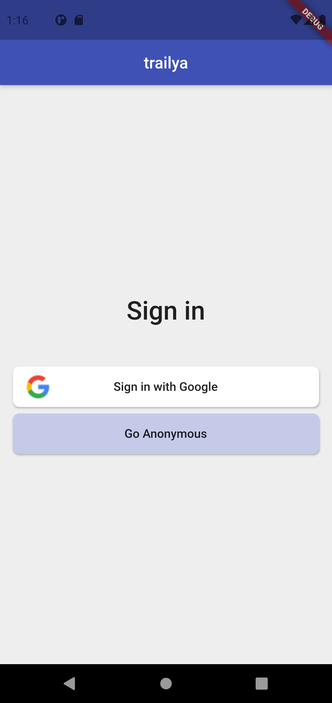
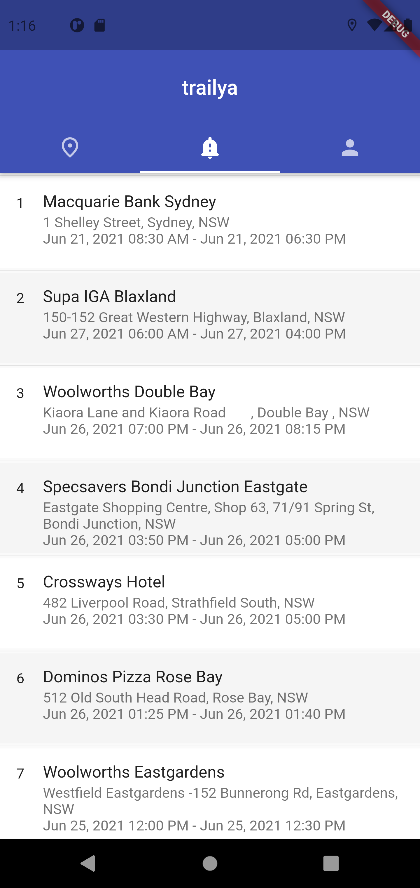
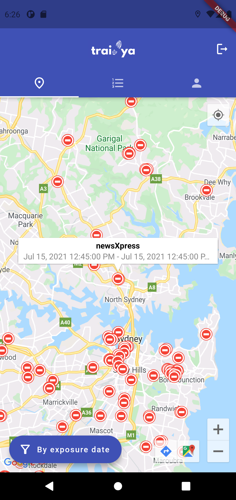
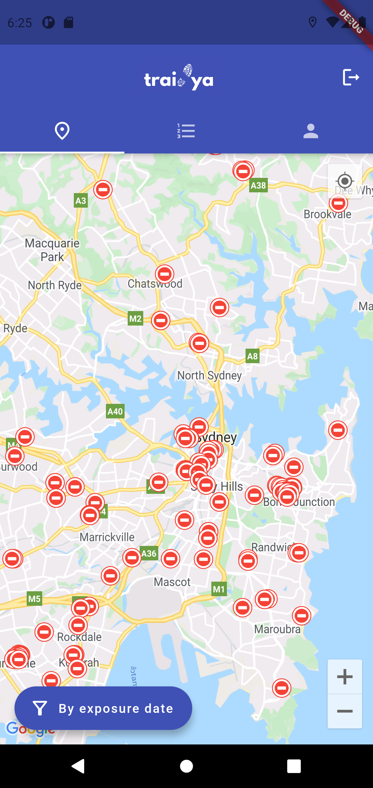
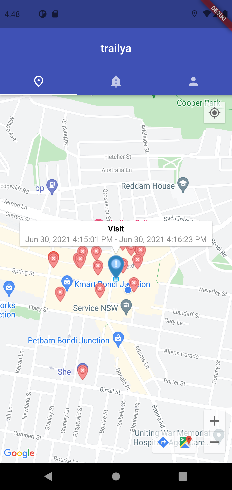
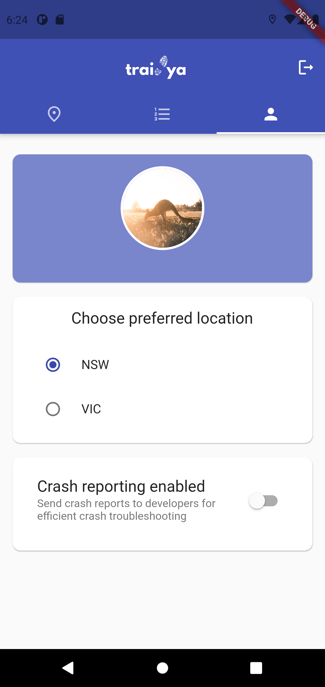
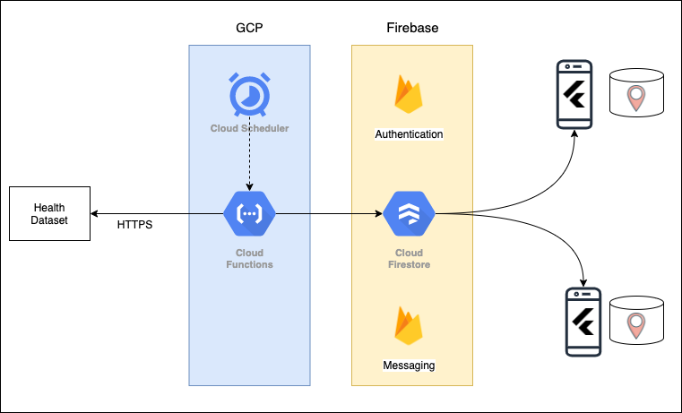
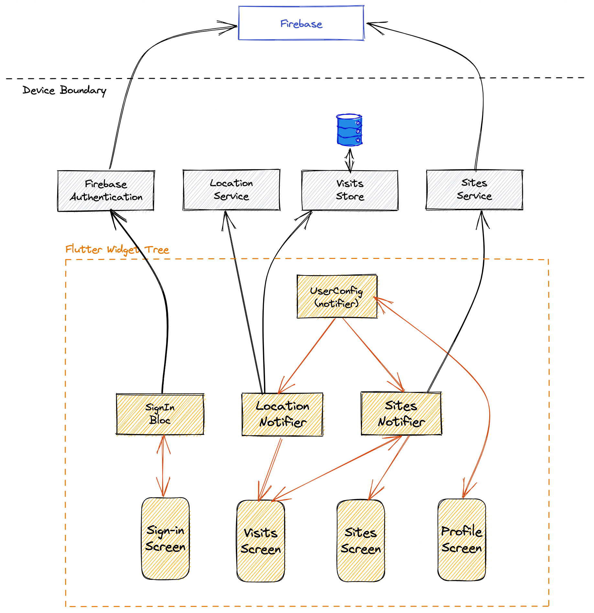

# trailya

Mobile app to track COVID exposure sites in Australia

### Why is it needed?

- COVID exposure site updates from Health services are not easy to consume (eg. huge tables on webpages, multiple tweets, PDF files etc.)
- How do I know with certainty if I was exposed?

### How does this help? 

A privacy-focussed app which:

- shows curent list of exposure sites; updates it regularly (daily, at present); also, shows them on a map.
- uses tracking to record locations where the user has spent more than a minute. 
  - these visits are also shown on the map to help determine if the user has been to an exposure site
  - user vists are stored only on the device (not shared outside); they are removed if older than 15 days
  - notify users if they've been to an exposure site (coming soon) 

#### Notes

- Supported on Android; iOS support in future.
- Supports NSW and VIC currently; other states will be supported soon

### Screenshots

| Sign In                                                      | Exposure Site List                                                          | Site                                                    |
| ------------------------------------------------------------ | --------------------------------------------------------------------------- | ------------------------------------------------------- |
|  |  |  |

| Site Details                                                            | Sites on map                                                            | My visits                                                       |
| ----------------------------------------------------------------------- | ----------------------------------------------------------------------- | --------------------------------------------------------------- |
|  |  |  |

| Profile  |
| -------  |
|  |

### System design

 

### Flutter design

 

